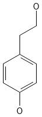
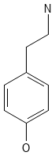
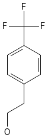
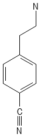
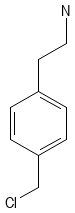
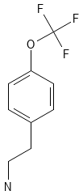

1.Utilizando PubChem Sketcher, dibujar cada uno de los 6 compuestos usando sus códigos SMILES.

CMP-1:

CMP-2:

CMP-3

CMP-4:

CMP-5:

CMP-6:

2.¿Qué motivo estructural comparten todos los compuestos? ("andamiaio" o scaffold común) ¿Qué sustituyentes (grupos químicos) están presentes en diferentes posiciones?

Todos comparten un anillo bencílico con una cadena del tipo –CH₂–CH₂–X. Además también poseen otro sustituyente particular en la posición 4 del anillo. El X en cada uno es fenol en el CMP-1 y 4 y una amina primaria en los otros 4. El sustituyente es un fenol en el CMP-1 y en el 2, un trifluormetilo en el 3 y el 4, un grupo ciano en el 5 y un clorometilo en el 6.

3.Compareción de compuestos por pares

a.CMP-1 vs CMP-2: ¿Qué diferencia estructural hay? ¿Qué grupo parece crucial para aumentar la actividad?

La única diferencia es la presencia de un fenol en el CMP-1 en donde en el CMP-2 hay una amina. Al ser la CMP-2 la que posee una mayor actividad entonces se deduce que el grupo amino tiene una mayor actividad que el fenol, posiblemente por su comportamiento básico.

b.CMP-2 vs CMP-3: ¿Qué nuevo grupo añade CMP-3? ¿Qué efecto tiene en la actividad?

A diferencia del 2 que tiene un fenol, el 3 tiene de grupo sustituyente un trifluormetilo. Esto tiene un efecto positivo en cuanto a la actividad.

c.CMP-4: Tiene el nuevo grupo de CMP-3 pero el grupo problemático de CMP-1

Pese a tener el grupo que aumenta la actividad de CMP-3, parece que el efecto del fenol en este caso baja la actividad y la sitúa como la segunda menos reactiva, lo que marcaría que la presencia de un ácido en ese lugar es el principal factor contra la actividad.

d.CMP-5 y CMP-6: ¿Qué tienen en común sus sustituciones con la de CMP-3?

CMP-5 y CMP-6 son casi tan eficaces como CMP-3. Esto se debe a que comparten el grupo amino en el sitio de unión. Por otro lado, en los 3 casos los sustituyentes poseen una densidad de carga negativa, lo que los habilita a atraer protones. Por ejemplo CMP-3 tiene 3 F capaces de formar PdH por lo que es el que mayor actividad tiene, CMP-5 puede formar un PdH gracias al N y CMP-6, es el que menos actividad tiene debido a que posee un Cl que si bien es negativo, no es capaz de formar PdHs.

4.Diseñar un nuevo compuesto análogo (CMP-7). Proponer un modelo farmacofórico simple que incluya:
-Un grupo funcional específico necesario para la unión
-Una región hidrofóbica o área que tolere sustituciones voluminosas con carácter electrónico-atrayente (halógenos, nitrilo)
-Scaffold común
-Grupo funcional crucial
-Nuevo sustituyente que boostea la actividad

Dejaría el grupo amino como sitio de unión y como sustituyente para potenciar la actividad pondría un trifluormeotxi, de tal forma que aumentás la cantidad de PdHs que puede formar. El Smile sería el siguiente: C1=CC(=CC=C1CCN)OC(F)(F)

5